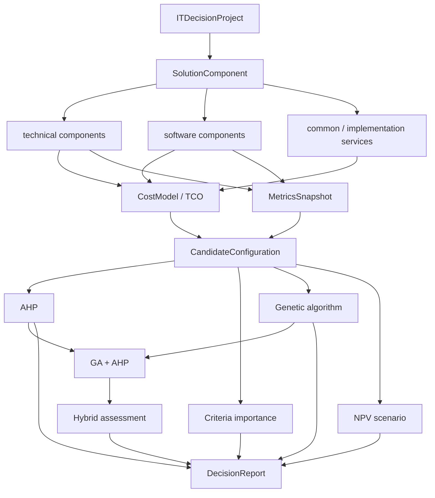

# Манифест концептуальной связанности проекта

## Назначение документа

Этот документ фиксирует не конкретную реализацию одного патча, а направление дальнейшего развития проекта `IT Cost Calculator` как единой системы поддержки принятия решений. Его задача — объяснить, какие данные, сущности и аналитические концепции уже связаны между собой, где связь пока держится на технических соглашениях, а где требуется более явная предметная модель.

Манифест нужен для будущих изменений по трём причинам:

1. **Чтобы не наращивать вкладки механически.** Новые экраны, расчёты и отчёты должны усиливать общий сценарий выбора ИТ-решения, а не превращать приложение в набор независимых калькуляторов.
2. **Чтобы разделение ПО и ТО развивалось последовательно.** Техническое обеспечение и программное обеспечение имеют разные признаки, ограничения и критерии оценки, но при этом оба должны входить в единую модель стоимости и выбора.
3. **Чтобы аналитические методы работали с общим смысловым объектом.** AHP, анализ важности критериев, генетический алгоритм, гибридная оценка и NPV должны объяснять один и тот же проект выбора, а не существовать как параллельные демонстрационные модули.

Документ не требует немедленной переработки архитектуры. Он задаёт концептуальную карту: какие будущие изменения считать логичными, какие — рискованными, и по каким признакам понимать, что проект становится связнее.

---

## 1. Текущее состояние: проект уже связан технически, но не полностью связан предметно

В текущем состоянии проект уже имеет сильную техническую основу:

- пользовательский интерфейс вынесен в `ui`;
- прикладные сценарии и сервисы находятся в `application`;
- предметная логика и алгоритмы находятся в `domain`;
- хранение, экспорт и технические адаптеры вынесены в `infrastructure`;
- документация, демо-данные и исследовательские материалы отделены от runtime-кода.

Это означает, что проект уже не является простой коллекцией файлов. Он имеет слои, карту модулей, runtime-хранилище и набор воспроизводимых демонстрационных сценариев.

Однако предметная связанность пока слабее технической. Многие модули уже работают рядом друг с другом, но общий смысловой объект ещё не выражен достаточно явно. Сейчас приложение в разных местах оперирует следующими понятиями:

- статья капитальных затрат;
- статья операционных затрат;
- оборудование;
- лицензия;
- профиль энергопотребления;
- конфигурация AHP;
- альтернатива анализа важности критериев;
- кандидатное решение генетического алгоритма;
- итоговая сводка затрат;
- NPV-сценарий.

Все эти объекты относятся к одному процессу выбора ИТ-решения, но в коде они пока не всегда связаны общей предметной сущностью. Из-за этого приложение местами выглядит как система из нескольких хорошо сделанных, но не до конца объединённых подсистем.

Ключевой тезис манифеста:

```text
Проект должен развиваться от набора расчётных и аналитических вкладок
к единой модели выбора ИТ-решения:

ИТ-решение → компоненты → затраты и метрики → альтернативы → методы анализа → отчёт выбора.
```

---

## 2. Что уже связано хорошо

### 2.1. Единое runtime-хранилище

Хороший фундамент проекта — наличие общего runtime-хранилища пользовательских сущностей:

```text
data/generated/runtime_entities.json
```

Через него проходят основные пользовательские данные. Это позволяет не держать каждую вкладку в полностью изолированном состоянии. Вкладки CAPEX, OPEX, электроэнергии, экспорта и аналитических сценариев могут обращаться к общему набору сущностей через прикладные сервисы.

Концептуально это правильное решение: пользователь не должен заново вводить одни и те же данные для каждого метода анализа. Однажды заданные компоненты ИТ-решения должны становиться исходным материалом для разных расчётов.

### 2.2. Разделение технического и программного обеспечения

В проекте уже введены области анализа:

```text
technical — техническое обеспечение;
software  — программное обеспечение.
```

Это важный шаг, потому что ПО и ТО нельзя корректно анализировать одним и тем же набором критериев. Для технического обеспечения естественны признаки мощности, клиентских мест, серверов, сетевых устройств и энергопотребления. Для программного обеспечения важнее лицензирование, функциональное покрытие, сопровождение, совместимость и стоимость владения ПО.

Уже есть базовое разделение капитальных категорий:

```text
ТО: server, client, network
ПО: licenses
```

Это направление следует сохранить и развить. В будущем область анализа должна стать не просто фильтром категорий, а полноценным профилем предметной логики.

### 2.3. Связка генетического алгоритма и AHP

Связка ГА + AHP является одной из самых зрелых концептуальных частей проекта.

Её смысл можно описать так:

```text
Генетический алгоритм ищет допустимые кандидатные конфигурации.
AHP независимо ранжирует найденный пул альтернатив.
Гибридная оценка сопоставляет поисковую пригодность и объяснимую многокритериальную оценку.
```

Это методически сильная конструкция, потому что генетический алгоритм отвечает за поиск вариантов, а AHP — за объяснимое сравнение. Они не дублируют друг друга, а решают разные задачи внутри общего процесса выбора.

Особенно важно, что AHP в этой связке не должен просто повторять итоговый GA-score. Его задача — дать независимый взгляд на тот же пул кандидатных решений. Это повышает защищаемость проекта: можно объяснить не только найденный результат, но и то, насколько он устойчив при другом методе ранжирования.

### 2.4. Демо-данные как мост между расчётами и аналитикой

`DecisionDemoDataService` уже выполняет роль мостика между runtime-данными и аналитическими сценариями. Он строит конфигурации, ограничения и кейсы анализа важности критериев для технической и программной областей.

Это важная функция, потому что демо-данные перестают быть отдельной фикстурой «для показа» и начинают отражать реальные данные приложения. Такой подход нужно сохранить: демонстрационные сценарии должны быть связаны с текущей моделью проекта, а не жить отдельно от неё.

---

## 3. Где сейчас основная развязанность

### 3.1. Нет явной центральной сущности ИТ-решения

Главная концептуальная проблема — отсутствие одной верхнеуровневой сущности, которая объединяла бы все расчёты и анализы.

Сейчас разные подсистемы фактически отвечают на близкие вопросы:

| Подсистема | Что она считает основным объектом |
|---|---|
| CAPEX | статьи капитальных затрат |
| OPEX | статьи операционных затрат |
| Электроэнергия | оборудование с параметрами мощности |
| NPV | инвестиционный сценарий |
| AHP | набор конфигураций |
| Анализ важности критериев | альтернативы и критерии |
| Генетический алгоритм | candidate items и candidate solutions |
| Экспорт | агрегированная сводка затрат |

Все эти объекты относятся к одному пользовательскому вопросу: какое ИТ-решение выбрать и почему. Но пока в модели нет явного объекта уровня `ITDecisionProject`, `ITSolution`, `CandidateConfiguration` или аналогичной сущности, которая связывала бы расчётные, технические, программные и аналитические данные.

Из-за этого новые функции легко начинают связываться через адаптеры, строки и соглашения, а не через устойчивую предметную модель.

### 3.2. Категории используются как предметная онтология

Сейчас значительная часть логики держится на строковых категориях:

```text
server
client
network
licenses
subscription_licenses
server_rental
migration
testing
backup
labor_costs
server_administration
```

Категории удобны для таблиц и быстрого хранения, но они слишком слабы для роли предметной модели. Одна строка `client` не может однозначно объяснить, является ли объект рабочим местом пользователя, периферийным устройством, МФУ или иным клиентским оборудованием. Строка `licenses` не различает бессрочную лицензию, подписку, пользовательский пакет, серверную лицензию или программный сервис.

Проблема проявляется в логике анализа. Например, техническая область может учитывать клиентские места, но не каждое устройство из категории `client` действительно создаёт рабочее место. МФУ, монитор или периферия могут относиться к клиентскому контуру, но не должны считаться отдельным пользователем.

Следовательно, категория должна остаться удобной группой для отображения, но не должна быть единственным источником смысла.

### 3.3. CAPEX, OPEX, электроэнергия и NPV связаны через агрегирование, но не через TCO-модель

Проект умеет считать капитальные затраты, операционные расходы, электроэнергию и NPV. Но концептуально эти блоки пока скорее складываются в итоговую сводку, чем образуют единую модель стоимости владения.

Для зрелой системы выбора ИТ-решения важно различать:

- стоимость покупки компонента;
- стоимость внедрения;
- стоимость миграции;
- стоимость тестирования;
- стоимость сопровождения;
- стоимость подписки;
- стоимость электроэнергии;
- ожидаемую экономию или эффект;
- денежный поток инвестиционного сценария.

Сейчас эти элементы присутствуют, но не всегда связаны с конкретным компонентом или альтернативой. Например, лицензия, подписка, миграция и тестирование могут относиться к одному программному решению, но в данных они находятся как отдельные статьи. Для дипломного и продуктового объяснения лучше, чтобы они собирались в общую стоимость владения конкретной альтернативой.

### 3.4. Аналитические методы используют разные форматы альтернатив

AHP, анализ важности критериев, генетический алгоритм и гибридная оценка работают с близкими понятиями, но представляют их по-разному:

- AHP использует конфигурации с набором устройств;
- анализ важности критериев использует альтернативы, критерии, отношения и scores;
- генетический алгоритм формирует candidate solutions;
- гибридная оценка сопоставляет GA-rank, AHP-rank и итоговые оценки.

Сейчас эти форматы связаны адаптерами. Это работает, но повышает сложность будущих изменений. Более устойчивое решение — ввести единую сущность кандидатной конфигурации, с которой смогут работать все методы.

### 3.5. Scope-логика частично находится в UI

Вкладка генетического подбора уже различает ПО и ТО, меняет обязательные категории, критерии, ограничения и подсказки. Это полезно для пользователя, но часть предметной логики оказывается в интерфейсе.

В долгосрочной архитектуре UI должен выбирать область анализа и показывать результат, а не самостоятельно знать, какие критерии и ограничения относятся к ПО или ТО. Эту логику лучше постепенно переносить в application/domain-уровень в виде профиля области анализа.

### 3.6. `DecisionDemoDataService` стал слишком важным мостом

Сервис демо-данных сейчас выполняет много смысловой работы:

- строит технические конфигурации;
- строит программные конфигурации;
- подбирает ограничения;
- формирует кейсы анализа важности критериев;
- масштабирует оценки;
- добавляет синтетические метрики.

Это не ошибка. На текущем этапе такой сервис помогает быстро связать вкладки. Но в будущем он может стать слишком большим центром неявной предметной логики. Если вся смысловая трансформация данных спрятана в одном демо-сервисе, то основная модель проекта остаётся неявной.

---

## 4. Целевая предметная модель

Дальнейшее развитие проекта стоит строить вокруг следующей цепочки:

```text
ITDecisionProject
    ↓
SolutionComponent[]
    ↓
CostModel + MetricsSnapshot
    ↓
CandidateConfiguration[]
    ↓
AnalysisCase
    ↓
DecisionReport
```

### 4.1. `ITDecisionProject`

Это верхнеуровневый объект пользовательского сценария. Он отвечает на вопрос: какой проект выбора или внедрения ИТ-решения рассматривается.

Возможные поля:

```text
id
name
description
created_at
updated_at
planning_horizon_years
currency
components
alternatives
analysis_reports
```

На раннем этапе эту сущность не обязательно сразу реализовывать в полном виде. Но она должна быть концептуальным ориентиром: все расчёты и анализы относятся не к абстрактным таблицам, а к проекту выбора ИТ-решения.

### 4.2. `SolutionComponent`

Компонент ИТ-решения должен заменить текущую зависимость от одних только категорий. Он может описывать сервер, рабочее место, сетевое устройство, периферию, лицензию, подписку, сервис внедрения или сопровождения.

Минимально полезная структура:

```text
id
name
scope: technical | software | common | implementation
category
component_type
quantity
unit_price
capabilities
cost_profile
source
```

Примеры `component_type`:

```text
server
workstation
peripheral
network_device
software_license
software_subscription
implementation_service
support_service
```

Пример смыслового различия:

```text
category = client
component_type = workstation
client_seats = 1
```

и

```text
category = client
component_type = peripheral
client_seats = 0
```

Такой подход позволяет сохранить привычные категории для интерфейса, но перестать использовать их как единственный источник предметного смысла.

### 4.3. `CostModel`

Стоимость владения должна собирать разные типы затрат в единую структуру.

```text
capex
one_time_opex
monthly_opex
electricity
implementation
support
subscription
```

На уровне компонента это может выглядеть так:

```text
purchase_cost
subscription_cost
implementation_cost
testing_cost
migration_cost
support_cost
energy_cost
```

На уровне альтернативы эти значения агрегируются в TCO-представление:

```text
total_capex
total_one_time_cost
total_monthly_cost
total_energy_cost
total_yearly_opex
total_cost_of_ownership
```

### 4.4. `MetricsSnapshot`

Метрики должны быть отделены от затрат. Стоимость — только один из критериев выбора. Для технической и программной областей нужны разные группы метрик.

Для ТО:

```text
client_seats
power_watts
energy_kwh
reliability_score
performance_score
network_coverage
reserve_capacity
lifespan
```

Для ПО:

```text
license_units
functional_coverage
support_score
compatibility_score
maintenance_complexity
development_potential
vendor_dependency
```

Это позволит честно объяснять, почему критерии ПО и ТО не одинаковые.

### 4.5. `CandidateConfiguration`

Это центральная сущность для AHP, Pareto/criteria-importance, GA и гибридной оценки.

```text
id
name
scope
components
totals
metrics
source: manual | demo | ga | catalog | imported
metadata
```

Смысл: любая аналитическая вкладка должна получать не произвольный формат, а набор кандидатных конфигураций. Тогда методы анализа станут разными способами посмотреть на один и тот же пул альтернатив.

### 4.6. `AnalysisCase`

Аналитический кейс описывает, какие альтернативы, критерии, ограничения и веса используются в конкретном запуске метода.

```text
id
name
scope
method: ahp | criteria_importance | ga | ga_ahp | hybrid | npv
alternatives
criteria
constraints
weights
relations
result
```

Это позволит хранить и экспортировать не только итог, но и условия анализа.

### 4.7. `DecisionReport`

Итоговый отчёт должен быть не просто CSV-сводкой затрат, а объяснением выбора.

Он может включать:

- исходные компоненты;
- расчёт стоимости;
- ограничения;
- пул альтернатив;
- результаты AHP;
- результаты GA;
- гибридную оценку;
- финансовую интерпретацию NPV;
- обоснование победителя;
- предупреждения о рисках и ограничениях анализа.

---

## 5. Как связать ПО и ТО логичнее

### 5.1. Разделять не только категории, но и область смысла

Текущее разделение по категориям полезно, но его недостаточно. В будущем каждая сущность должна иметь область:

```text
scope = technical | software | common | implementation
```

Примеры:

| Объект | scope | category | component_type |
|---|---|---|---|
| Сервер | technical | server | server |
| Ноутбук сотрудника | technical | client | workstation |
| МФУ | technical | client | peripheral |
| Коммутатор | technical | network | network_device |
| Бессрочная лицензия | software | licenses | software_license |
| Подписка | software | subscription_licenses | software_subscription |
| Миграция | implementation | migration | implementation_service |
| Тестирование | implementation | testing | implementation_service |
| Администрирование сервера | technical | server_administration | support_service |
| Резервное копирование | common | backup | support_service |

Такое разделение позволит корректнее строить вкладки ПО и ТО, а также честнее считать стоимость владения.

### 5.2. ПО не должно наследовать технические ограничения

Для ПО не должны применяться ограничения вроде:

- минимальное количество клиентских мест как физических устройств;
- максимальная мощность;
- обязательное наличие сервера, клиента и сети.

Вместо этого для ПО естественны другие ограничения:

- минимальное количество лицензий;
- покрытие ключевых функций;
- ограничение ежемесячной подписки;
- совместимость с выбранной инфраструктурой;
- наличие сопровождения;
- приемлемая сложность внедрения.

### 5.3. ТО не должно притворяться ПО и наоборот

В технической вкладке лицензии не должны оцениваться как физическое оборудование. В программной вкладке оборудование не должно оцениваться как лицензии. Но в итоговом проекте выбора они должны встречаться снова, потому что реальное ИТ-решение обычно смешанное.

Поэтому нужна трёхуровневая логика:

```text
1. Отдельный анализ ТО.
2. Отдельный анализ ПО.
3. Сводный анализ всего ИТ-решения.
```

---

## 6. Как связать CAPEX, OPEX, электроэнергию и NPV

### 6.1. CAPEX и OPEX должны стать частями TCO

Сейчас CAPEX и OPEX технически агрегируются, но концептуально их стоит трактовать как части общей стоимости владения.

```text
TCO = капитальные затраты
    + разовые затраты внедрения
    + операционные расходы за период
    + электроэнергия за период
    + сопровождение и подписки
```

Пользователю важна не только цена покупки, но и то, во сколько решение обойдётся за год или несколько лет.

### 6.2. Электроэнергия должна быть метрикой компонента и затратой сценария

Мощность оборудования должна быть свойством компонента, а расчёт электроэнергии — производной от режима работы.

```text
component.power_watts
component.quantity
energy_profile.hours_per_day
energy_profile.working_days
tariff
```

Тогда вкладка электроэнергии не будет держать отдельную смысловую копию оборудования. Она будет рассчитывать эксплуатационную стоимость на основе общей модели компонентов.

### 6.3. NPV должен использовать результаты общей модели стоимости

NPV лучше воспринимать не как отдельный калькулятор, а как финансовое продолжение выбора ИТ-решения.

Связь должна быть такой:

```text
CAPEX → начальные инвестиции
OPEX + электроэнергия → ежегодные/ежемесячные оттоки
ожидаемый эффект/экономия → притоки
горизонт планирования + ставка дисконтирования → NPV
```

Тогда NPV станет частью объяснения инвестиционной привлекательности выбранной альтернативы.

---

## 7. Как связать аналитические методы

### 7.1. Единый пул альтернатив

Все аналитические методы должны работать с единым понятием `CandidateConfiguration`.

```text
Runtime components
    ↓
CandidateConfiguration[]
    ↓
AHP / Criteria Importance / GA / Hybrid / NPV
    ↓
DecisionReport
```

Это не означает, что все методы должны иметь одинаковую математику. Это означает, что они должны сравнивать один и тот же тип предметного объекта.

### 7.2. AHP

AHP должен отвечать на вопрос:

```text
Какая альтернатива предпочтительнее при заданных критериях и весах?
```

Ему нужны:

- альтернативы;
- критерии;
- оценки альтернатив по критериям;
- матрица или веса критериев;
- интерпретация победителя.

### 7.3. Анализ важности критериев

Анализ важности критериев должен отвечать на вопрос:

```text
Какие критерии сильнее влияют на выбор и какие альтернативы остаются недоминируемыми?
```

Он должен использовать те же альтернативы, но может иметь собственный способ задания отношений между критериями.

### 7.4. Генетический алгоритм

ГА должен отвечать на вопрос:

```text
Какие допустимые варианты можно найти при заданных ограничениях?
```

Он не должен быть жёстко привязан к ИТ-предметной области. Его универсальность — сильная сторона. Но прикладной слой должен переводить предметные компоненты в корректные candidate items и обратно в `CandidateConfiguration`.

### 7.5. ГА + AHP

Связка ГА + AHP должна отвечать на вопрос:

```text
Согласуется ли поисковое решение ГА с объяснимым многокритериальным ранжированием?
```

Смысл этой связки — не в том, чтобы AHP подтвердил ГА любой ценой, а в том, чтобы показать:

- совпал ли победитель;
- насколько близки ранги;
- есть ли альтернативы с более убедимым AHP-профилем;
- насколько устойчив итоговый выбор.

### 7.6. Гибридная оценка

Гибридная оценка должна быть компромиссным объяснением, а не заменой исходных методов. Она полезна, если явно показывает вклад:

- GA-score;
- AHP-score;
- нормализации по пулу кандидатов;
- итогового ранга;
- причин расхождения.

---

## 8. Роль профилей области анализа

Чтобы не размазывать scope-логику по UI, стоит ввести концепцию профиля области анализа.

```text
AnalysisScopeProfile
```

Возможная структура:

```text
scope
label
title
capital_categories
operational_categories
component_types
criteria
constraints
default_weights
metric_extractors
explanation_rules
```

Пример для ТО:

```text
scope: technical
categories: server, client, network
criteria: coverage, client_seats, power, cost, reliability
constraints: budget, max_power, required_server, required_client, required_network
```

Пример для ПО:

```text
scope: software
categories: licenses, subscription_licenses
criteria: functionality, license_units, ownership_cost, support, compatibility
constraints: budget, license_minimum, subscription_limit, required_functional_coverage
```

Пользовательский интерфейс в этом случае только выбирает профиль и отображает его. Прикладной слой отвечает за смысл.

---

## 9. Роль старой вкладки ИТ-инфраструктуры

В проекте сохраняется вкладка, унаследованная от более ранней структуры приложения. Она может быть полезной, но её роль нужно определить явно.

Возможны три стратегии:

1. **Оставить как песочницу пользовательских статей.** Тогда нужно прямо указать, что она не является основным источником структурированной аналитики.
2. **Скрыть или постепенно вывести из основного сценария.** Тогда основной ввод должен идти через ПО, ТО, OPEX и связанные формы.
3. **Привести к общей модели компонентов.** Тогда она может стать универсальным редактором `SolutionComponent`.

Наиболее логичный путь — третий, но его лучше делать только после стабилизации центральной модели компонентов.

---

## 10. Принципы будущих изменений

### 10.1. Не добавлять новую вкладку без места в общей модели

Перед добавлением новой вкладки нужно ответить:

- какую сущность она создаёт или анализирует;
- как эта сущность связана с ИТ-решением;
- какие данные она берёт из runtime-модели;
- какие результаты отдаёт другим модулям;
- должна ли она участвовать в экспорте и итоговом отчёте.

### 10.2. Не использовать строковую категорию как единственный источник смысла

Категория может использоваться для группировки и отображения, но предметная логика должна опираться на дополнительные признаки:

- scope;
- component_type;
- capabilities;
- cost_kind;
- recurrence;
- related_component_id.

### 10.3. Не переносить предметную логику в UI

UI должен:

- показывать форму;
- читать ввод пользователя;
- вызывать use case;
- отображать результат.

UI не должен самостоятельно определять, что считается корректной программной или технической альтернативой. Это задача application/domain-слоя.

### 10.4. Каждый аналитический результат должен быть воспроизводимым

Для AHP, GA, гибридной оценки и NPV важно хранить:

- входные альтернативы;
- критерии;
- веса;
- ограничения;
- параметры запуска;
- seed, если используется стохастический алгоритм;
- итоговый результат;
- объяснение.

Это особенно важно для дипломной защиты: результат должен быть не только красивым, но и проверяемым.

### 10.5. Разделение ПО и ТО не должно ломать сводный сценарий

ПО и ТО нужно анализировать отдельно, потому что у них разная природа. Но пользовательский итог должен снова собирать их вместе.

Правильный баланс:

```text
отдельные предметные профили → общая стоимость владения → единый отчёт выбора.
```

---

## 11. Предлагаемая дорожная карта

### Этап 1. Документировать и стабилизировать текущую модель

Цель: не менять поведение, а явно описать текущие сущности и связи.

Возможные действия:

- описать текущие категории как временную предметную схему;
- зафиксировать различие `technical` и `software`;
- описать, какие OPEX-категории относятся к ПО, ТО, внедрению и общему контуру;
- добавить таблицу соответствия категорий будущим `scope` и `component_type`.

Риск низкий: изменения только в документации и, возможно, в константах без изменения поведения.

### Этап 2. Добавить явные `scope` и `component_type`

Цель: перестать выводить весь смысл только из категории.

Возможные действия:

- расширить runtime-строки необязательными полями `scope` и `component_type`;
- добавить обратную совместимость: если поля отсутствуют, выводить их из текущей категории;
- описать правила миграции старых данных;
- добавить проверки на корректность новых полей.

Риск средний: затрагиваются формы ввода, runtime-хранилище и сервисы чтения данных. Нужно сохранять совместимость со старыми JSON.

### Этап 3. Ввести профиль области анализа

Цель: вынести знания о ПО/ТО из UI в прикладной слой.

Возможные действия:

- создать `AnalysisScopeProfile`;
- перенести списки категорий, критериев, ограничений и подсказок в профиль;
- заставить вкладки получать профиль через сервис;
- оставить UI только отображение и выбор области.

Риск средний: изменения в UI и application-слое. Проверять нужно особенно сценарии ГА и ГА + AHP.

### Этап 4. Унифицировать альтернативы

Цель: сделать `CandidateConfiguration` общим форматом для AHP, criteria-importance, GA и гибридной оценки.

Возможные действия:

- описать dataclass или словарную схему `CandidateConfiguration`;
- добавить адаптеры из текущих AHP-конфигураций и GA candidate solutions;
- постепенно перевести аналитические сервисы на общий формат;
- сохранить экспорт старого формата на переходный период.

Риск средний/высокий: это затрагивает аналитические сценарии. Требуются регрессионные проверки без cacheprovider и без генерации мусорных файлов.

### Этап 5. Связать TCO и NPV

Цель: превратить NPV в финансовое продолжение общей модели стоимости.

Возможные действия:

- собирать annual/monthly outflows из CAPEX/OPEX/электроэнергии;
- добавить понятие ожидаемого эффекта или экономии;
- связать альтернативу с финансовым сценарием;
- включить NPV-результат в итоговый отчёт выбора.

Риск средний: важно не усложнить пользовательский ввод и не сделать финансовую модель непрозрачной.

### Этап 6. Сформировать единый `DecisionReport`

Цель: объединить расчёты и аналитику в один защищаемый результат.

Возможные действия:

- расширить экспорт отчётом по выбранной альтернативе;
- добавить разделы: состав, стоимость, ограничения, AHP, GA, hybrid, NPV, риски;
- сделать JSON-экспорт машинно читаемым, а CSV/текстовый экспорт — удобным для пользователя;
- связать отчёт с материалами для дипломной защиты.

Риск средний: нужно аккуратно не смешать пользовательский экспорт и внутренние debug-данные.

---

## 12. Критерии того, что проект стал связнее

Проект можно считать концептуально более связанным, если выполняются следующие признаки:

1. **Один компонент используется в нескольких расчётах без повторного ввода.** Например, сервер участвует в CAPEX, электроэнергии, GA, AHP и экспорте.
2. **ПО и ТО различаются не только названием вкладки.** У них разные критерии, ограничения, метрики и интерпретации.
3. **OPEX связан с предметной областью.** Подписки, сопровождение, миграция и тестирование имеют понятную принадлежность к ПО, ТО, внедрению или общему контуру.
4. **Альтернативы имеют единый формат.** AHP, GA и hybrid сравнивают один и тот же тип кандидатной конфигурации.
5. **NPV использует расчётную базу проекта.** Финансовый сценарий не живёт отдельно от CAPEX/OPEX/электроэнергии.
6. **Итоговый отчёт объясняет выбор.** Пользователь видит не только сумму, но и причину, почему выбранное решение лучше других.
7. **Демо-сценарии не расходятся с runtime-моделью.** Контрольные примеры и демонстрации строятся из тех же сущностей, что и пользовательские данные.

---

## 13. Что не следует делать

### 13.1. Не превращать каждую идею в отдельный независимый модуль

Если новая функция не связана с общей моделью ИТ-решения, она усилит разрозненность. Даже полезный расчёт может ухудшить архитектуру, если не понятно, куда он отдаёт результат.

### 13.2. Не делать ПО частным случаем оборудования

ПО имеет собственную природу: лицензии, подписки, сопровождение, совместимость, функциональное покрытие. Его нельзя корректно оценивать только через цену и количество.

### 13.3. Не делать ТО частным случаем стоимости

Техническое обеспечение — это не только цена. Для него важны мощность, рабочие места, сеть, надёжность, запас роста, энергопотребление и эксплуатационная устойчивость.

### 13.4. Не смешивать демо-логику и предметную модель

Демо-сервис может помогать формировать сценарии, но он не должен быть единственным местом, где определено, что такое техническая или программная конфигурация.

### 13.5. Не ломать совместимость старых данных ради чистоты модели

Новая предметная модель должна вводиться с миграционным слоем. Старые runtime-файлы и демо-фикстуры должны продолжать открываться.

---

## 14. Минимальная целевая схема



Эта схема не обязана быть реализована за один патч. Она задаёт направление: любые будущие изменения должны приближать проект к связке компонентов, стоимости, метрик, альтернатив и объяснимого отчёта выбора.

---

## 15. Практический ориентир для следующих патчей

Если следующий патч будет менять код, его стоит формулировать не как «добавить ещё один расчёт», а как один из следующих шагов:

- «добавить явную принадлежность сущностей к ПО/ТО/внедрению»;
- «сделать профиль области анализа источником критериев и ограничений»;
- «унифицировать формат альтернатив для AHP и GA»;
- «связать OPEX-категории с общей TCO-моделью»;
- «подготовить DecisionReport как итоговый объект выбора»;
- «связать NPV с рассчитанными затратами проекта».

Такой подход позволит развивать проект плотными, но логичными патчами: каждый новый шаг будет не просто добавлять функциональность, а укреплять общую предметную архитектуру.
