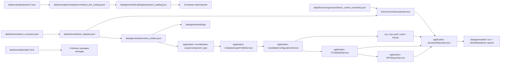

# Карта данных

Ниже показано, какие группы данных используются в проекте и как они движутся между каталогами.



## Группы данных

### 1. Демонстрационные, учебные и регрессионные данные
- `data/fixtures/demo_scenarios.json` — реестр ролей данных: учебные, демонстрационные и регрессионные;
- `data/fixtures/demo_dataset.json` — сквозной демонстрационный набор для ручной загрузки и demo/control-сценария;
- `data/fixtures/regression/demo_control_invariants.json` — инварианты контрольного сценария без `pytest`;
- `data/examples/ahp/` — учебные и эталонные наборы для AHP;
- `data/examples/optimization/` — учебные примеры для оптимизационных сценариев;
- `data/examples/parser/` — сохранённые снимки парсинга.

### 2. Рабочие runtime-данные
- `data/generated/runtime_entities.json` — текущее состояние пользовательских сущностей;
- `data/generated/logs/` — логи приложения;
- `data/generated/catalog/` — рабочий каталог оборудования;
- `data/generated/ahp/` — выходные файлы расчётов и отчётов.

### 3. Каталог оборудования
- `data/examples/catalog/normalized_dns_catalog.json` — пример нормализованного каталога;
- `data/generated/catalog/equipment_catalog.json` — рабочий каталог, формируемый инструментом обновления.

## Таблица артефактов

| Артефакт | Где лежит | Кто создаёт | Кто использует |
|---|---|---|---|
| Реестр demo-ролей | `data/fixtures/demo_scenarios.json` | разработчик | документация, smoke-проверки, будущая автоматизация |
| Демонстрационный набор | `data/fixtures/demo_dataset.json` | разработчик/исходная фикстура | GUI, CLI загрузки, `DemoControlScenarioService` |
| Регрессионные инварианты demo | `data/fixtures/regression/demo_control_invariants.json` | разработчик | `scripts/run_demo_control_scenario.py --check-only` |
| Runtime-сущности | `data/generated/runtime_entities.json` | приложение | GUI, сервисы, экспорт |
| CSV-отчёт | `data/generated/` или пользовательский путь | сценарий экспорта | пользователь |
| Каталог оборудования | `data/generated/catalog/equipment_catalog.json` | `tools/catalog_parser` | основное приложение, тесты |
| Пример каталога | `data/examples/catalog/normalized_dns_catalog.json` | подготовленный пример | тесты, документация |
| DecisionReport JSON | `data/generated/decision_report.json` | `DecisionReportService` + exporter | пользователь, разработчик, будущая автоматизация отчёта |
| DecisionReport Markdown | `data/generated/decision_report.md` | `DecisionReportService` + exporter | защита, пояснение выбора |
| DecisionReport CSV-срез | `data/generated/decision_report_candidates.csv` | `DecisionReportService` + exporter | табличный просмотр альтернатив |
| Логи | `data/generated/logs/it_cost_calc.log` | приложение | разработчик |


## Runtime-нормализация после этапа 2

`data/generated/runtime_entities.json` и старые фикстуры могут не содержать явных полей `scope` и `component_type`. Прикладной слой достраивает эти признаки через `RuntimeEntityNormalizationService` перед тем, как записи попадут в сервисы стоимости, GA/AHP-сценарии или экспорт.

Переходная логика не переносится во вкладки интерфейса: UI передаёт категорию и пользовательские поля, а application-слой решает, относится ли запись к `technical`, `software`, `implementation` или `common`, и какой `component_type` можно безопасно назначить.

Особое правило действует для `client`: если у записи нет `client_seats` и явного `component_type=workstation`, она не считается рабочим местом автоматически. Поэтому периферия остаётся частью клиентского контура, но не закрывает ограничения по пользователям.

## Профили анализа после этапа 3

После нормализации runtime-записей прикладной слой выбирает профиль области анализа через `AnalysisScopeProfileService`. Профиль определяет, какие категории становятся кандидатами, какие критерии и ограничения применяются, какие подсказки показываются в UI и какие metadata попадают в GA/AHP export payload.

```text
runtime_entities.json → RuntimeEntityNormalizationService → AnalysisScopeProfileService → GA / GA+AHP / AHP / Pareto / export
```

Благодаря этому вкладки больше не являются главным источником знаний о различиях ПО и ТО: они выбирают `scope`, а прикладной слой возвращает правила анализа. Подробности описаны в `analysis_scope_profiles.md`.


## Единый пул альтернатив после этапа 4

После профилей анализа прикладной слой формирует общий пул `candidate_configurations`. Это переходный формат между runtime-компонентами и аналитическими методами. Он не заменяет старые поля мгновенно: `configurations`, `candidate_solutions`, `alternatives` и `scores` сохраняются, но рядом с ними появляется единый контракт альтернативы.

```text
runtime_entities.json
  → RuntimeEntityNormalizationService
  → AnalysisScopeProfileService
  → CandidateConfigurationService
  → AHP / GA / GA+AHP / анализ важности критериев / будущий DecisionReport
```

В `CandidateConfiguration` исходные компоненты лежат отдельно от агрегированных итогов и метрик:

| Блок | Что содержит |
|---|---|
| `components` | исходные позиции оборудования, ПО или услуг |
| `totals` | стоимость и агрегированные суммы |
| `metrics` | производительность, надёжность, лицензии, места, оценки критериев |
| `metadata` | источник, legacy-формат, параметры GA/AHP и диагностические поля |

Подробный контракт описан в `candidate_configurations.md`.


## TCO и финансовая база NPV после этапа 5

После формирования общего пула альтернатив прикладной слой может собрать стоимость владения. `TCOModelService` принимает `CandidateConfiguration` или текущие итоги CAPEX/OPEX/электроэнергии и формирует блок `tco`: стартовые инвестиции, ежемесячные и годовые расходы, стоимость электроэнергии за период и итоговую стоимость владения.

```text
CandidateConfiguration / current cost totals
  → TCOModelService
  → totals.tco
  → NPVReportService
```

NPV больше не обязан начинаться с пустого ручного ввода. Вкладка NPV может подставить рассчитанные CAPEX/OPEX/электроэнергию как финансовую базу, а пользователь затем добавляет ожидаемый эффект или экономию в денежные потоки. Это сохраняет объяснимость: сервис показывает, какие суммы попали в NPV, и предупреждает, если эффект не задан. Подробности описаны в `tco_npv_bridge.md`.

## DecisionReport после этапа 6

После TCO/NPV-моста данные могут быть собраны в единый итоговый отчёт выбора. `DecisionReportService` не запускает методы заново, а фиксирует текущее состояние runtime-компонентов, стоимости, пула альтернатив и уже рассчитанных аналитических результатов.

```text
runtime_entities.json
  → RuntimeEntityNormalizationService
  → CandidateConfigurationService / TCOModelService / аналитические методы
  → DecisionReportService
  → decision_report.json + decision_report.md + decision_report_candidates.csv
```

JSON остаётся полным машинным отчётом, Markdown — пользовательским объяснением для защиты, CSV — кратким табличным срезом альтернатив. Если AHP, GA, GA + AHP или NPV ещё не запускались, отчёт формируется как частичный и явно содержит предупреждения. Подробности описаны в `decision_report.md`.

## Старая ИТ-песочница после этапа 7

Вкладка `ИТ-песочница` не является основным источником CAPEX/OPEX-аналитики. Новые свободные статьи сохраняются в `runtime_entities.json` с префиксом `legacy_infrastructure:` и служебной пометкой `_legacy_sandbox=true`.

```text
ИТ-песочница
  → data/generated/runtime_entities.json: legacy_infrastructure:*
  → DecisionReport raw components, strict_analysis_participation=false
```

`CandidateConfigurationService` пропускает такие группы при построении строгого runtime-кандидата. Поэтому свободные заметки остаются видимыми для инспекции, но не подмешиваются в GA/AHP, TCO и NPV без отдельного решения о нормализации. Подробности описаны в `legacy_infrastructure_tab.md`.


## Демо-контроль после этапа 8

Демонстрационный набор теперь является частью общей модели, а не отдельным набором строк для заполнения вкладок. Верхнеуровневые metadata-поля в `demo_dataset.json` описывают роль набора, сценарий и воспроизводимость; runtime-загрузчик по-прежнему берёт только блок `entities`, поэтому совместимость сохранена.

```text
data/fixtures/demo_dataset.json
  → RuntimeEntityNormalizationService
  → DecisionDemoDataService
  → CandidateConfigurationService
  → TCOModelService
  → DecisionReportService
```

`DemoControlScenarioService` проверяет, что известные CAPEX/OPEX-строки имеют `scope` и `component_type`, что для ТО и ПО строятся `candidate_configurations`, что каждая альтернатива получает `totals.tco`, а `DecisionReport` видит тот же пул альтернатив. Проверка запускается без тестового раннера:

```bash
python -B scripts/run_demo_control_scenario.py --check-only
```

Подробный контракт описан в `docs/demo/demo_data_contract.md`.

## Предметный контракт категорий

Физическое движение данных описывает этот файл, а смысл текущих CAPEX/OPEX-категорий закреплён в `current_subject_schema.md`. Там указано, какие категории относятся к техническому обеспечению, программному обеспечению, внедрению и общему контуру, а также как они должны перейти к будущим признакам `scope` и `component_type`.

Короткая связь между картами:

| Уровень | Где описан | Что фиксирует |
|---|---|---|
| Физическое хранение | `data_map.md` | какие JSON/CSV/лог-файлы создаются и кто их использует |
| Предметный смысл | `current_subject_schema.md` | что означают категории `server`, `client`, `licenses`, `migration`, `backup` и другие |
| Будущая эволюция | `conceptual_cohesion_roadmap.md` | как перейти от категорий к `scope`, `component_type`, профилям анализа и общей модели альтернатив |

## Главный принцип

В репозитории разделены:
- **фикстуры и примеры** — то, на чём воспроизводятся сценарии;
- **runtime-данные** — то, что создаётся в ходе работы приложения;
- **каталог оборудования** — внешний справочник, обновляемый отдельным инструментом.
