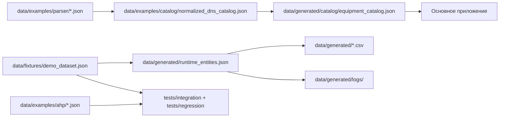

# Карта данных

Ниже показано, какие группы данных используются в проекте и как они движутся между каталогами.

## Группы данных

### 1. Демонстрационные и эталонные данные
- `data/fixtures/demo_dataset.json` — демонстрационный набор для ручной загрузки;
- `data/examples/ahp/` — эталонные наборы для AHP;
- `data/examples/optimization/` — примеры для оптимизационных сценариев;
- `data/examples/parser/` — сохранённые снимки парсинга.

### 2. Рабочие runtime-данные
- `data/generated/runtime_entities.json` — текущее состояние пользовательских сущностей;
- `data/generated/logs/` — логи приложения;
- `data/generated/catalog/` — рабочий каталог оборудования;
- `data/generated/ahp/` — выходные файлы расчётов и отчётов.

### 3. Каталог оборудования
- `data/examples/catalog/normalized_dns_catalog.json` — пример нормализованного каталога;
- `data/generated/catalog/equipment_catalog.json` — рабочий каталог, формируемый инструментом обновления.

## Таблица артефактов

| Артефакт | Где лежит | Кто создаёт | Кто использует |
|---|---|---|---|
| Демонстрационный набор | `data/fixtures/demo_dataset.json` | разработчик/исходная фикстура | GUI, тесты, CLI загрузки |
| Runtime-сущности | `data/generated/runtime_entities.json` | приложение | GUI, сервисы, экспорт |
| CSV-отчёт | `data/generated/` или пользовательский путь | сценарий экспорта | пользователь |
| Каталог оборудования | `data/generated/catalog/equipment_catalog.json` | `tools/catalog_parser` | основное приложение, тесты |
| Пример каталога | `data/examples/catalog/normalized_dns_catalog.json` | подготовленный пример | тесты, документация |
| Логи | `data/generated/logs/it_cost_calc.log` | приложение | разработчик |

## Главный принцип

В репозитории разделены:
- **фикстуры и примеры** — то, на чём воспроизводятся сценарии;
- **runtime-данные** — то, что создаётся в ходе работы приложения;
- **каталог оборудования** — внешний справочник, обновляемый отдельным инструментом.
