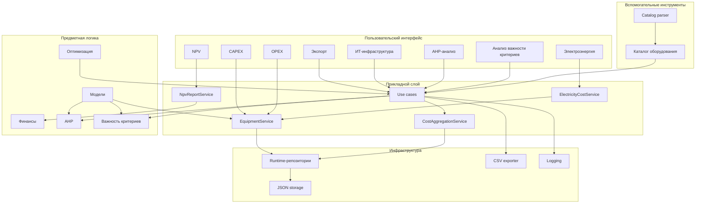

# Карта модулей

Эта карта показывает не только каталоги репозитория, но и смысловые связи между ними.
Подробное описание каждого модуля вынесено в `modules.md`.

## Практическое чтение карты

- вкладки `CAPEX`, `OPEX`, `Электроэнергия`, `NPV`, `Экспорт`, `AHP` и `Анализ важности критериев` — это видимая часть системы;
- `application` связывает пользовательские действия с расчётами и хранением данных;
- `domain` содержит математику и модели;
- `infrastructure` хранит состояние и формирует выходные файлы;
- `tools/catalog_parser` обслуживает внешний справочник оборудования и не входит в runtime GUI.
