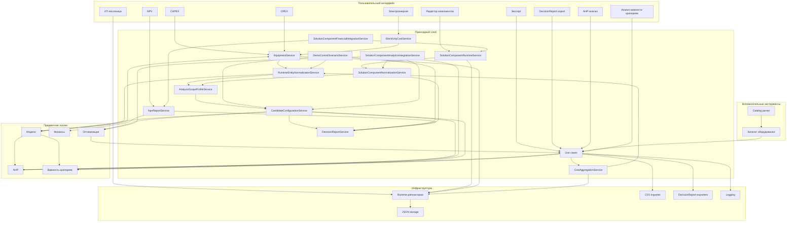

# Карта модулей

Эта карта показывает не только каталоги репозитория, но и смысловые связи между ними.
Подробное описание каждого модуля вынесено в `modules.md`.

## Практическое чтение карты

- вкладки `CAPEX`/`ТО`/`ПО`, `OPEX`, `Электроэнергия`, `NPV`, `Экспорт`, `AHP` и `Анализ важности критериев` — это видимая часть основного аналитического сценария;
- `ИТ-песочница` остаётся вспомогательной legacy-вкладкой: она пишет свободные статьи в runtime-хранилище с префиксом `legacy_infrastructure:`, но не является источником строгой предметной модели;
- `Редактор компонентов` работает с `SolutionComponent` для нестандартных и составных случаев, а не заменяет быстрые вкладки ПО/ТО;
- `application` связывает пользовательские действия с расчётами и хранением данных; переходная нормализация `scope`/`component_type`, профили ПО/ТО, адаптация к `CandidateConfiguration`, demo/control-сценарий и сборка `DecisionReport` выполняются здесь, а не в UI;
- `domain` содержит математику и модели;
- `infrastructure` хранит состояние и формирует выходные файлы, включая JSON/Markdown/CSV-представления `DecisionReport`;
- `tools/catalog_parser` обслуживает внешний справочник оборудования и не входит в runtime GUI.

## Где находятся ключевые связующие сервисы

| Сервис | Слой | Роль в общей цепочке |
|---|---|---|
| `RuntimeEntityNormalizationService` | `application` | Достраивает `scope`, `component_type`, `client_seats` и legacy-признаки. |
| `AnalysisScopeProfileService` | `application` | Хранит профили ПО/ТО: критерии, ограничения, категории и подсказки. |
| `CandidateConfigurationService` | `application` | Приводит runtime-записи и результаты методов к единому формату альтернатив. |
| `SolutionComponentNormalizationService` | `application` | Нормализует компоненты редактора, рассчитывает warnings и признаки допуска. |
| `SolutionComponentRuntimeService` | `application` | Хранит `SolutionComponent` в `entities.solution_components` и отделяет strict-компоненты от draft. |
| `SolutionComponentFinancialIntegrationService` | `application` | Передаёт расходы компонентов редактора в TCO и NPV-базу без искусственного эффекта. |
| `SolutionComponentAnalyticsIntegrationService` | `application` | Передаёт profile-ready компоненты в AHP/GA через `CandidateConfiguration`. |
| `TCOModelService` | `application` | Собирает стоимость владения и финансовую базу NPV. |
| `DecisionReportService` | `application` | Формирует единый итоговый отчёт выбора. |
| `DemoControlScenarioService` | `application` | Проверяет, что демонстрационный набор проходит всю цепочку без отдельной смысловой модели. |
| `decision_report_exporter` | `infrastructure` | Записывает отчёт в JSON, Markdown и CSV-срез альтернатив. |

Эти сервисы являются главной причиной, почему предметная логика больше не размазана по вкладкам интерфейса.
