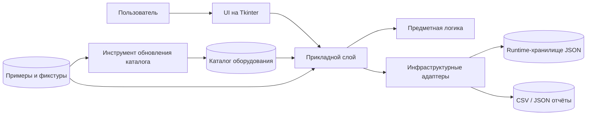

# Архитектурная схема

Ниже показана укрупнённая схема проекта: что относится к пользовательскому приложению, что отвечает за данные, а что вынесено во вспомогательный инструмент обновления каталога оборудования.

## Смысл схемы

- `UI` принимает действия пользователя и показывает результаты.
- `Прикладной слой` координирует сценарии: расчёты, экспорт, загрузку демо-данных.
- `Предметная логика` содержит модели, формулы, AHP, анализ важности критериев и оптимизационные алгоритмы.
- `Инфраструктурные адаптеры` отвечают за хранение, экспорт и логирование.
- `Инструмент обновления каталога` живёт отдельно от GUI и формирует каталог оборудования как внешний справочник.

## Главный архитектурный принцип

Основное приложение работает с уже подготовленными данными и аналитическими моделями.
Сетевой сбор данных о товарах, HTML-разбор и исследовательские эксперименты не смешиваются с пользовательским runtime приложения.
