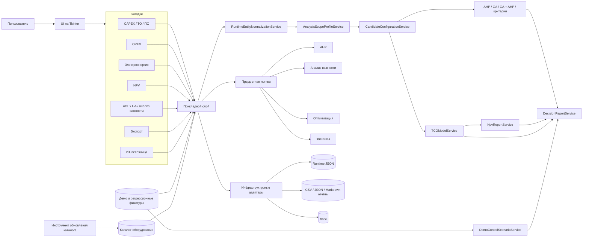

# Архитектурная схема

Ниже показана укрупнённая схема проекта после завершения roadmap концептуальной связанности. Она отражает не только технические слои, но и основной поток данных от ввода компонентов до итогового отчёта выбора.

## Смысл схемы

- `UI` принимает действия пользователя и показывает результаты, но не является владельцем предметной модели.
- `RuntimeEntityNormalizationService` делает старые и новые записи сопоставимыми через `scope` и `component_type`.
- `AnalysisScopeProfileService` хранит различия ПО и ТО: категории, критерии, ограничения, веса и объяснения.
- `CandidateConfigurationService` превращает компоненты и результаты методов в общий пул альтернатив.
- `TCOModelService` связывает CAPEX, OPEX, внедрение, сопровождение и электроэнергию.
- `NpvReportService` использует рассчитанные затраты как основу финансовой оценки, а не как ручной повторный ввод.
- `DecisionReportService` собирает компоненты, стоимость, альтернативы, результаты методов, NPV, риски и предупреждения в единый итоговый артефакт.
- `ИТ-песочница` сохраняет legacy-сценарий свободных статей, но её записи отделены от строгой аналитики.

## Главный архитектурный принцип

Основное приложение работает с подготовленными компонентами, профилями, альтернативами и отчётами. Сетевой сбор данных, HTML-разбор и исследовательские эксперименты не смешиваются с пользовательским runtime приложения.
