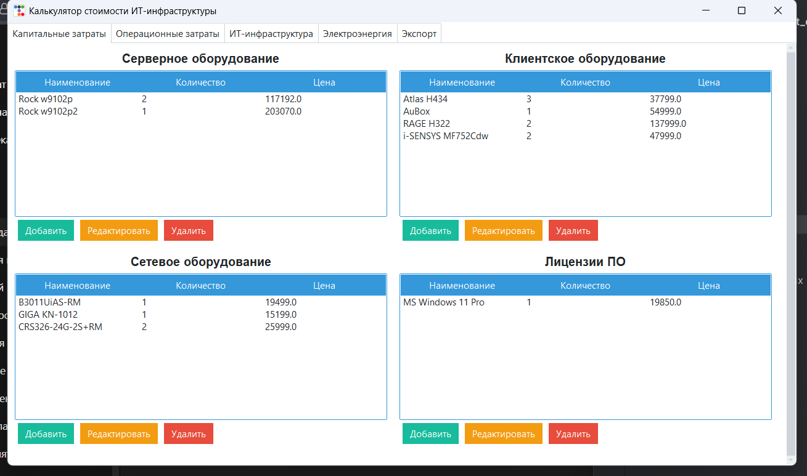
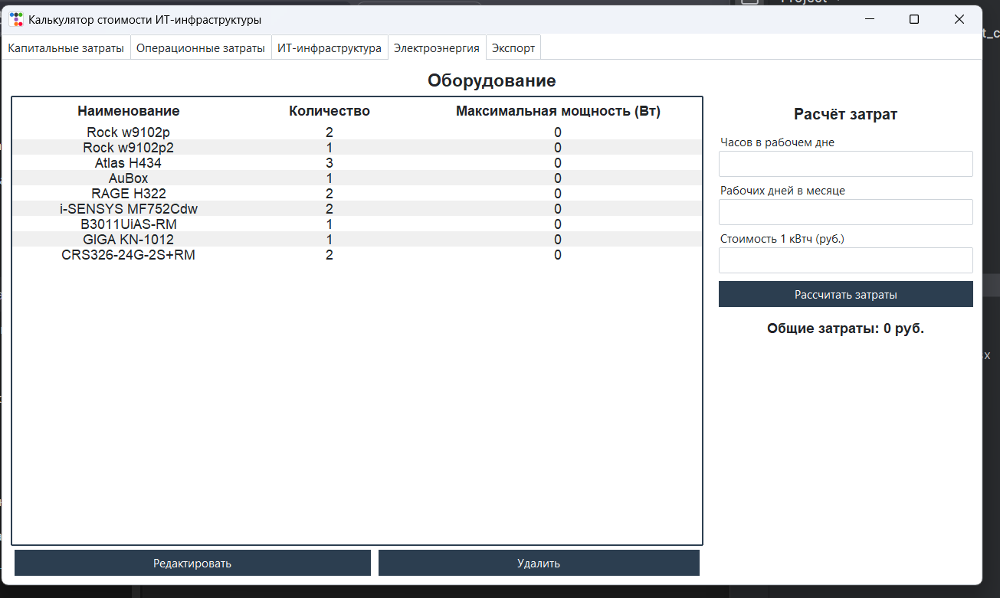
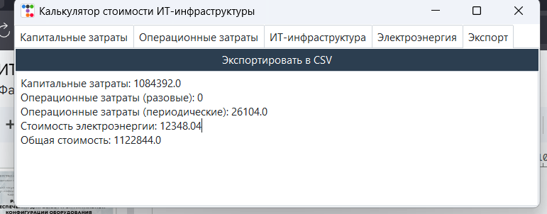

# Скриншоты приложения

Ниже приведены скриншоты интерфейса, извлечённые из проектных презентационных материалов и используемые как иллюстрации текущего вида приложения.

## Вкладка капитальных затрат

Экран показывает раздельный ввод серверного, клиентского, сетевого оборудования и лицензий ПО.

## Вкладка ИТ-инфраструктуры

Здесь отображается состав оборудования и выполняется расчёт затрат, связанных с инфраструктурой и режимом эксплуатации.

## Вкладка экспорта

Экран сводит рассчитанные значения и позволяет выгрузить итоговый отчёт в CSV.
